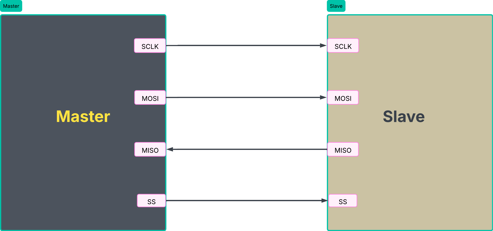
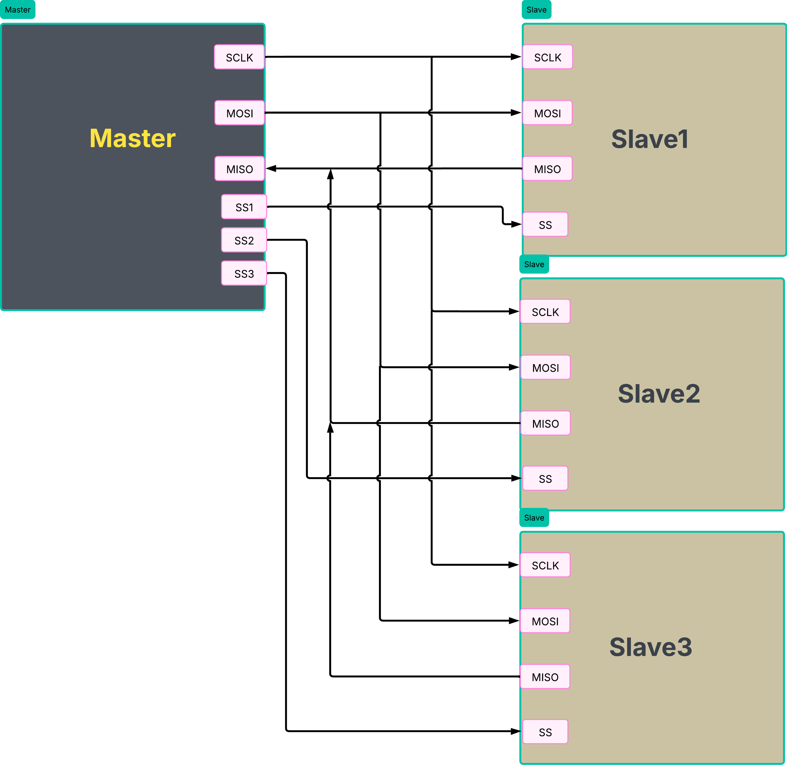

# SPI Master RTL Design (Verilog)

## 📌 Overview

This project implements a **Serial Peripheral Interface (SPI) Master** controller in Verilog. The design uses a finite state machine (FSM) architecture and supports configurable SPI modes (CPOL/CPHA), making it suitable for digital IC design portfolios and VLSI coursework.

---

## 🏗️ Block Diagram
Master - single slave
<p align="center">
  
</p>

Mater - multi slave
<p align="center">
  
</p>


The SPI Master interfaces with slave devices through four control signals:
- **MOSI** (Master Out, Slave In): Data line from master to slave
- **MISO** (Master In, Slave Out): Data line from slave to master  
- **SCLK** (Serial Clock): Clock signal generated by master
- **CS_N** (Chip Select): Active-low slave selection signal

---

## 🔄 FSM Design


**FSM States:**
- **IDLE**: Waiting for transmission request
- **SETUP**: Preparing clock and control signals
- **SHIFT**: Serially shifting data in/out
- **DONE**: Transmission complete, asserting done flag

---


Supports both SPI modes:
- **Mode 0** (CPOL=0, CPHA=0): Clock idles low, data sampled on rising edge
- **Mode 3** (CPOL=1, CPHA=1): Clock idles high, data sampled on falling edge

---

## 📂 Project Structure

```
SPI_Master/
│
├── rtl/
│   ├── spi_master.v           # Main SPI Master RTL
│   └── spi_master.v       # Package definitions (parameters, localparam)
│
├── tb/
│   ├── spi_master_tb.v        # Testbench with stimulus
│   └── spi_slave_tb.v      # Simple slave model for testing
│   └── spi_top_testbench.v      #  complete testing
│
├── docs/
│   ├──assets/imgaeg/...
│
│
└── README.md                  # This file
```

---

## 🔧 RTL Parameters

```verilog
parameter CPOL = 0;            // Clock polarity (0 or 1)
parameter CPHA = 0;            // Clock phase (0 or 1)
parameter DATA_WIDTH = 8;      // Word size in bits
parameter CLK_DIV = 2;         // Clock divider for SCLK generation
```

---


---

## 🧠 Key Features

✅ **FSM-based Architecture**: Clean, maintainable state machine design  
✅ **Configurable SPI Modes**: Support for CPOL and CPHA selection  
✅ **Parameterized Design**: Easily adjust DATA_WIDTH and CLK_DIV  
✅ **Shift Register Logic**: Serial data transmission with proper alignment  
✅ **Chip Select Handling**: Active-low CS_N with proper assertion/deassertion  
✅ **Done Signal**: Indicates successful transmission completion  

---

## ⚠️ Challenges & Solutions

|           Challenge           |                           Solution                                      |
|-------------------------------|-------------------------------------------------------------------------|
| CPOL/CPHA timing misalignment | Studied SPI protocol specs; implemented mode-based clock edge selection |
|   Data shift register bugs    | Debugged with GTKWave; verified with known-good waveforms               |
|    FSM state transitions      | Added explicit state transition conditions; tested edge cases           |
|   Shadow register issues      | Implemented proper synchronization between clock domains                |

---

## 📈 Learnings & Skills Developed

- **SPI Protocol**: Deep understanding of serial communication timing and modes
- **FSM Design**: State machine synthesis and verification methodologies
- **RTL Debugging**: Using GTKWave for waveform inspection and root cause analysis
- **Verilog Best Practices**: Parameterized design, proper reset handling, blocking/non-blocking assignments
- **Digital Verification**: Testbench stimulus generation and functional coverage concepts

---

## 🔗 Resources & References

- [SPI Protocol Specification](https://en.wikipedia.org/wiki/Serial_Peripheral_Interface)
- [NXP SPI protocol](https://www.nxp.com/docs/en/application-note/AN3904.pdf)
- [Analog devices](https://www.analog.com/en/resources/analog-dialogue/articles/introduction-to-spi-interface.html)
- **LinkedIn**: [Awaiz - VLSI](https://linkedin.com/in/awaiz-logde)
- **GitHub**: [VLSI Projects Repository](https://github.com/Awaizlogde)
- **YouTube**: [Awaiz - VLSI Channel](https://youtube.com/@awaiz-vlsi)

---

## 📝 Notes for Recruiters / Portfolio Review

This project demonstrates:
1. **Digital Design Expertise**: FSM architecture and low-level RTL implementation
2. **Problem-Solving**: Systematic debugging of timing and synchronization issues
4. **Technical Communication**: Clear documentation with diagrams and waveforms
5. **Practical Skills**: Hands-on Verilog synthesis and simulation using industry-standard tools

---

## 📬 Contact & Discussion

Open to discussions on:
- VLSI design methodologies
- RTL optimization techniques
- SPI and other protocol implementations
- Physical Design and Timing in VLSI
- Digital IC design career

**LinkedIn**: [@awaiz-logde](https://linkedin.com/in/awaiz-logde)  
**Email**: [awaizlogde45@gmail.com]

---

## 📜 License

This project is created for educational and portfolio purposes.

---

**Last Updated**: March 2026  
**Status**: Complete & Verified ✅
